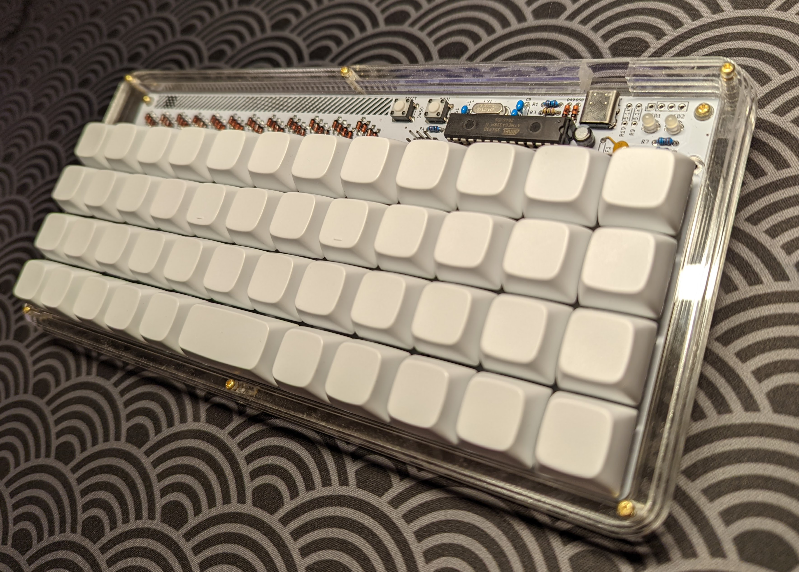

# Keyboard Cases

A collection of keyboard cases I've designed. For each keyboard case, I provide all files for assembly, as well as instructions for setting up the keyboard case. Most of my cases target 40% ortholinear keyboards. 

| Case                             | Mounting Style               | Target Keyboard                        | Photo                                            |
| -------------------------------- | ---------------------------- | -------------------------------------- | ------------------------------------------------ |
| [Qlavier](./qlavier-style-plaid) | Silicone o-ring burger mount | [Plaid](https://github.com/hsgw/plaid) |  |
| [Planckeneko](./planckeneko)     | Gummy o-ring gasket mount    | [Planck](https://olkb.com/)            |          |

