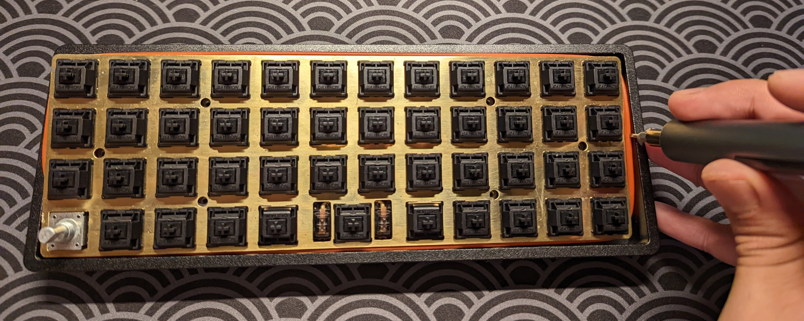

# Planckeneko

*A gummy o-ring gasket-mounted case for the popular [Planck](https://olkb.com/collections/planck) keyboard. Based on the cleverly designed [Bakeneko 60](https://github.com/kkatano/bakeneko-60).*

This project provides hardware files and assembly instructions for building a CNC-machined brass-weighted gasket-mounted case for the [Planck](https://olkb.com/collections/planck) keyboard. Alternative hardware files are provided for CNC-machining a version of the case without the brass weight, but explicit instructions are not provided (assembly can be figured out from the instructions for the brass-weighted version). This project also provides hardware files for making a 3D-printed version of the case, and again, explicit assembly instructions are not provided, because the assembly can be inferred from the instructions for the brass-weighted version here. 

## BOM

Aside from the CNC-machined (or 3D-printed) parts*, the following items are needed for the case:

| Item                                                         | Unit Price (USD) | Quantity | Source                                                       |
| ------------------------------------------------------------ | ---------------- | -------- | ------------------------------------------------------------ |
| Soft silicone o-ring, 3/32 fractional width, 164 dash number | 10.18            | 1        | McMaster [1173N461](https://www.mcmaster.com/1173N461/)      |
| Unified daughterboard, 4-pin JST cable, four M2 x4 mm screws | 8.00             | 1        | Cannon Keys [UNIFIED-DB](https://cannonkeys.com/products/unified-daughterboard-and-jst-cable) ** |
| M2 x4 mm brass hex drive flat head screw                     | 7.33 / n         | 2        | McMaster [97595A266](https://www.mcmaster.com/97595A266/)    |
| Wide furniture bumpers                                       | 6.98 / 4         | 4        | ASIN [B0856T8HJF](https://www.amazon.com/gp/product/B0856T8HJF/ref=ppx_yo_dt_b_search_asin_title?ie=UTF8&psc=1) |

*If 3D-printing, use the files found [here](./3dp). If CNC-machining with no brass bar, use the files found [here](./cnc-plain). If CNC-machining with the weighted brass bar, use the files found [here](./cnc-weighted). 

**The daughterboard is [open-sourced](https://github.com/ai03-2725/Unified-Daughterboard), so it can be manufactured for cheaper, but in multiples, at a PCB fabrication house. 

## Assembly

The [drawing](./assets/drawing.png) gives us a reasonable idea of the case geometry. Note the recesses on the bottom:

Lay out the CNC'd parts.

Use the flat head M2 screws to screw the brass bar into the bottom recess of the main case body. Carefully stick on the furniture bumpers into their dedicated recesses. 

We now need to modify the Planck PCB. We need to desolder the original USB-C port off the Planck. Then, we need to cut out the jutted part of the PCB that supported the original USB-C port. I found that a pair of flush-cutters did the trick just fine. The image below marks in red what the PCB looks like after the protrusion's been cut:

Notice that the above image also has some red, blue, black, and yellow wires soldered in. These wires are the JST cable wires that go into the USB-C daughterboard. The Planck PCB has a neat feature, where we can bypass the original USB port, and install our own upstream. This feature is handy in the case of defective USB ports, but it's also handy because it lets us install a daughterboard, which is expected of mostf gasket-mounted keyboards.  Unfortunately, the daughterboard JST wires that come from Cannon Keys are not the standard colours for USB 2.0, so we should look at the [daughterboard's datasheet](https://github.com/ai03-2725/Unified-Daughterboard/wiki/PCB-side-design-resources) (doing so is always good practice, anyway). Here, we can see the USB pinout for the daughterboard:

Similarly, we can see the USB pinout silkscreened on the breakout holes of the Planck PCB:

We can ignore the SHD pin, and connect the USB pins on the Planck PCB to the corresponding USB daughterboard PCB pins. The Planck PCB clearly doesn't have a JST connector though, so we're going to cut off the JST connector on one end of the cable, and solder the wires directly to the Planck (as shown a few images above, with the red, blue, black, and yellow wires). The daughterboard has JST connectors though, so we can just click those in place. Remember to solder the JST wires to the _bottom_ side of the Planck PCB. Once all the electrical connections are complete, screw the daughterboard into the case. We should now have something that looks like this:

We now install the switches and switch plate, just like a normal keyboard build. Then, we wrap the o-ring around the entire PCB / switch plate, such that the o-ring sits happily between PCB and the switch plate. Set this construction into the keyboard case, with the south side facing first. The o-ring on the south side of the PCB construction should sit nicely on the semi-circular columns found on the inside edge of the case.

Use a flathead screwdriver to push down the o-ring and the PCB assembly, all around the assembly's edges. Eventually, the o-ring should be reasonably hidden (but admittedly, not completely, depending on your view angle). 

That's it! Enjoy your newfound soft typing feel, and the improved acoustics. 

## Future Improvements

Honestly, I'm pretty happy with the build. If I had to change one thing, I'd probably make the edges of the keyboard a little taller, so that they hide the switches---but that's just a minor aesthetic preference. 