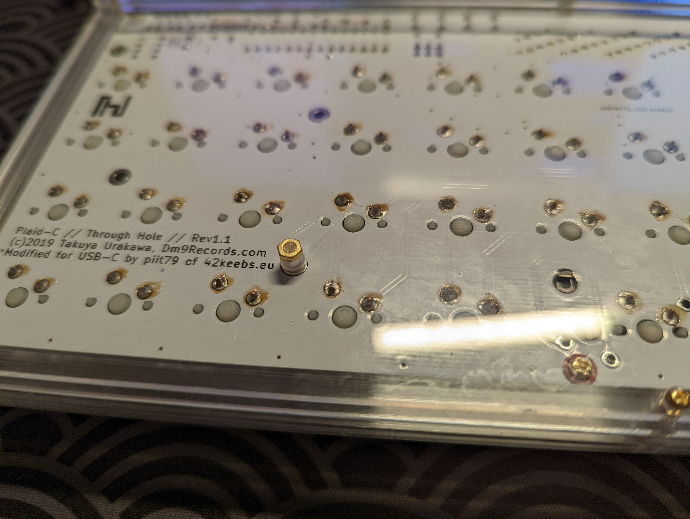

# Qlavier-Style Case for the Plaid Keyboard

*A silicone burger-mounted stacked acrylic case for the [Plaid](https://github.com/hsgw/plaid) keyboard, reverse engineered from [Qlavier](https://qlavier.com)'s [image gallery](https://imgur.com/a/e2AHRcN).*

This project provides hardware files and assembly instructions for building a stacked acrylic case for the [Plaid](https://github.com/hsgw/plaid) keyboard. It's a reverse engineering of [Qlavier](https://www.qlavier.com/)'s case design for the keyboard. 

## BOM

Aside from the M2 x8mm screws and the 1/8" thick acrylic, one of the linked M2 standoff screw kits is all you need. In general, aside from the small silicone o-rings, the parts listed here are very standard and easy to source. 

| Item                                                         | Unit Price (USD) | Quantity | Source                                                       |
| ------------------------------------------------------------ | ---------------- | -------- | ------------------------------------------------------------ |
| M2 x20 mm (F-F) hex standoffs 3 mm from hexagon edge to opposite edge | 13.99 / n        | 3        | ASIN [B07PDQ7DVS](https://www.amazon.com/gp/product/B07PDQ7DVS/ref=ppx_yo_dt_b_search_asin_title?ie=UTF8&th=1) |
| M2 x10 mm, but preferably M2x12 mm, (F-F) hex standoffs 3 mm from hexagon edge to opposite edge | 13.99 / n        | 3        | ASIN [B07PDQ7DVS](https://www.amazon.com/gp/product/B07PDQ7DVS/ref=ppx_yo_dt_b_search_asin_title?ie=UTF8&th=1) |
| M2 x5mm screws                                               | 13.99 / n        | 14       | ASIN [B07PDQ7DVS](https://www.amazon.com/gp/product/B07PDQ7DVS/ref=ppx_yo_dt_b_search_asin_title?ie=UTF8&th=1) |
| M2 nuts                                                      | 13.99 / n        | 2        | ASIN [B07PDQ7DVS](https://www.amazon.com/gp/product/B07PDQ7DVS/ref=ppx_yo_dt_b_search_asin_title?ie=UTF8&th=1) |
| M2 x8 mm screws                                              | 12.04 / 50       | 2        | McMaster [92942A801](https://www.mcmaster.com/92942A801/)    |
| 1/8" thick acrylic                                           | ~                | ~        | ~                                                            |
| Silicone o-rings, 4 mm OD, 1 mm ID, 1.5 mm ring width        | 5.49 / n         | 2        | ASIN [B082SVFWCS](https://www.amazon.com/gp/product/B082SVFWCS/ref=ppx_yo_dt_b_search_asin_title?ie=UTF8&th=1) |

## Assembly

We want to try and assemble something that looks like this render:

It's hard to see the footbar from the render, but we want to order the acrylic such that the narrower feet are on the bottom, and the wider feet are on the top. We use three screws and three F-F hex standoffs to secure the feet together, from the bottom. 

We then stack on the layers that will hold the actual case. We want to order the layers such that it gets wider in the middle, and narrower at the ends. Make sure to position the USB cutout to the right side, so that it matches up with the Plaid's USB port. Do not yet put on the very top layer that would cover the exposed PCB components. 

We now need to prepare the PCB. Install the stabilizers first, like with any keyboard build. Then, install the screws. 

For the north-most two mounting holes, slip the silicone o-rings on the screws such that there's an o-ring above the PCB, and an o-ring beneath the PCB. Very little of the screw threads should be sticking past the bottom o-rings. Despite what the following photo shows, _do not yet install the switches and switch plate_. 

We're going to use the longer M2 x8 mm screws for the south-most mounting holes on the PCB. We're going to slip on the silicone o-rings onto the screw threads from _only the bottom side of the PCB_, for these two screws. So each bottom screw has one less o-ring than its top-screw counterpart. 

Now install the switches and switch plate, like you would for any keyboard build. Finally, put on the top plate. The top plate is obvious, because it will cover the PCB's top through-hole components, and its holes are circular clearance holes for M2 screws, as opposed to hexagonal cut-outs for the standoffs. _Be extremely careful when handling the top layer._ The south side of the top layer is really delicate, and can break easily, until it's screwed in to the rest of the case. 

Finally, we're going to flip the keyboard upside-down. Find the exposed threads of the south-most PCB-mounting screws, and screw on the M2 nuts. If not enough of the threads are exposed, push the top part of the screw with something like a very skinny hex wrench, while screwing in the nut. 

Tada! :tada: We're done! Enjoy the keyboard! 

## Future Improvements

I think I'd make the following improvements, if I had to do this build again:

- The clearance on the USB cutout from the left side (when the keyboard is viewed from the top) is a little too tight. I'd cut it out more to the left. 
- The top layer is way too delicate. It's because I just carved out the interior of the top layer last minute, to give enough clearance for the keycaps. Ideally, I'd move the screw holes on all the layers closer to the outside edge, and (or) I'd give the keyboard more of a bezel. 
- I should make cutouts for the ICSP pins, as well as the boot and reset buttons, so I don't have to unscrew the top layer each time I want to make low-level changes. 